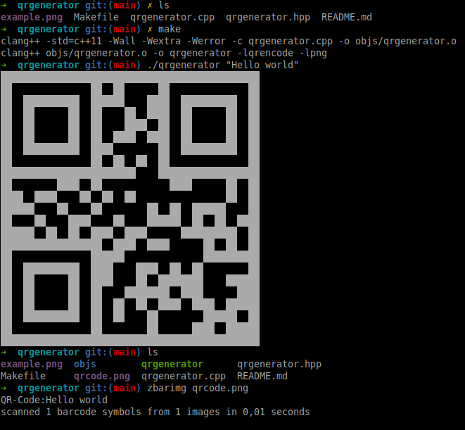
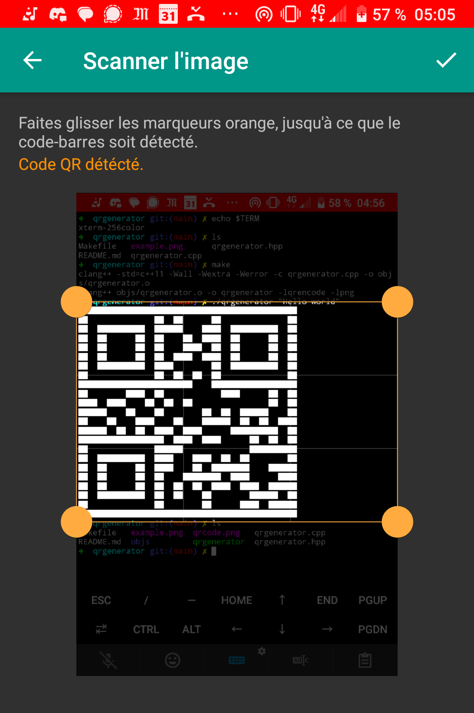

# qrgenerator

## Description

This program creates a QR code with the string given from the
command line, then:<br />
 - It prints the QR code on the terminal.
 - It saves the QR code as a PNG file.
<br /><br />
You can verify the generated code with:<br />
 `zbarimg qrcode.png`


## Requirement
* Qrencode<br />
Used for producing QRcodes.
```
sudo apt install libqrencode-dev
```

* PNG Library
Used for producing QRcodes.
```
sudo apt install libpng-dev
```

## Commands
```
// Run
make
./qrencode <string to convert>
```


## Screenshots
### Linux


### Termux
<p>
	
	
</p>

