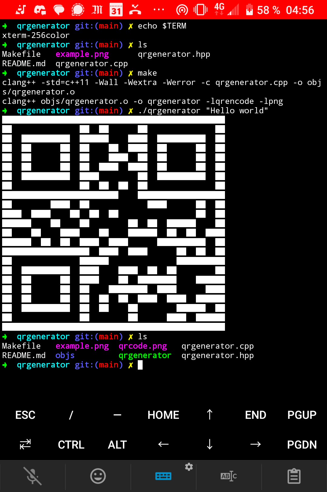

# **qrgenerator**

## **Description**

This program creates a QR code (Quick Response code) with the string provided from the command line, then:  
- It prints the QR code on the terminal.  
- It saves the QR code as a PNG file.  

### **vCard Generation**
Additionally, the repository includes a sample vCard format. You can edit the vCard file and use it as input to generate a QR code that will be recognized as contact information, making it easy to add to a phone.

```bash
// Example usage with vCard:
./qrgenerator "$(cat vcard-example.txt)"
```

The QR code generated using the vCard will contain the contact information and can be scanned by a phone to save the contact directly.

```bash
// You can verify the generated code with:
sudo apt install zbar-tools
zbarimg qrcode.png
```

---

## **Requirements**

### **1. Qrencode**  
`libqrencode` is a C library designed for generating QR codes. It is widely used in various applications to create QR codes that can store information such as URLs, text, contact information, and more. The library is efficient, lightweight, and provides a straightforward API for developers to integrate QR code generation into their applications.

```bash
sudo apt install libqrencode-dev
// Or, on Termux (Android)
pkg install libqrencode
```

---

### **2. PNG Library**  
Used for producing image files in PNG format that contain the QR codes.

```bash
sudo apt install libpng-dev
// Or, on Termux
pkg install libpng
```

---

## **Commands**
```bash
// Run
make
./qrgenerator <string_to_convert>
```

---

## **Screenshots**

### **Linux**


---

### **Termux (Android)**
<p>
    
    
</p>


---

## **Notes on QR Code Generation**

QR code generation involves encoding data into a 2D matrix of black and white squares. Each square, known as a **module**, represents either a binary 0 (white) or 1 (black). The pattern and arrangement of these modules are designed to allow accurate decoding, even with some level of distortion or damage. Here are the main characteristics of QR code generation:

---

### 1. **Structure of a QR Code**

A QR code consists of several key components, each serving a specific purpose:

#### **Finder Patterns (Orientation Squares):**
- **Location:** Found in three corners of the QR code (top-left, top-right, bottom-left).
- **Purpose:** Used to detect and align the QR code during scanning, regardless of its orientation (rotation or tilt).
- **Appearance:** Large black-and-white square patterns, with an outer black square, a white square inside it, and a black square in the center.

#### **Alignment Patterns:**
- **Location:** Smaller squares located near the bottom-right corner and at multiple locations in larger QR codes.
- **Purpose:** Help correct distortion when scanning the QR code at an angle.
- **Appearance:** Single black squares surrounded by white, embedded within the data matrix.

#### **Timing Patterns:**
- **Location:** Horizontal and vertical lines connecting the three finder patterns.
- **Purpose:** Ensure proper alignment and module placement.
- **Appearance:** Alternating black and white modules.

#### **Quiet Zone (Margin):**
- **Location:** Empty border around the QR code.
- **Purpose:** Provides clear separation from other elements in the environment, ensuring accurate scanning.
- **Appearance:** White space surrounding the QR code.

---

### 2. **Encoding Data into Modules**

- **Modules:** The smallest square units in the QR code, representing data or functional components. Each module is either black (binary 1) or white (binary 0).
- **Data Encoding:**
  - The data is encoded using binary representations.
  - Error correction codes (e.g., Reed-Solomon codes) are added to ensure the QR code can be decoded even if part of it is damaged.
  - Encoded data is interleaved with error correction data and mapped into the QR code grid.

---

### 3. **Error Correction Levels**
QR codes use **error correction** to restore data if part of the code is damaged or obscured. There are four levels of error correction:
- **Level L (Low):** Can restore up to 7% of the code.
- **Level M (Medium):** Can restore up to 15%.
- **Level Q (Quartile):** Can restore up to 25%.
- **Level H (High):** Can restore up to 30%.

---

### 4. **Masking**
- **Purpose:** To prevent large areas of the QR code from appearing uniformly black or white, which can interfere with scanning.
- **Process:** Different masking patterns (predefined algorithms) are applied to the QR code to balance the distribution of black and white modules. The pattern resulting in the least visual artifacts is chosen.

---

### 5. **Module Values:**
- Each module has a specific value depending on its function:
  - **Black Module:** Represents a binary 1.
  - **White Module:** Represents a binary 0.

---

### 6. **Error Correction and Redundancy**
The encoded data is combined with error correction codes, which introduce redundancy. This ensures that the QR code can still be decoded if up to a certain percentage of it is damaged or obscured.

---

### 7. **Data Representation**
QR code data is encoded into modules using the following steps:
1. **Encoding Mode Selection:** Numeric, alphanumeric, binary, or Kanji encoding is chosen based on the input data.
2. **Data Segmentation:** Input data is segmented and converted into binary form.
3. **Data Placement:** Binary data is interleaved with error correction data and placed in the QR code grid.

---

### 8. **Scanning and Decoding**
When a QR code is scanned:
1. Finder and alignment patterns are used to locate and orient the QR code.
2. The scanner reads the modules and decodes the binary data.
3. Error correction is applied to recover any corrupted data.
4. The final data is interpreted based on the encoding mode.